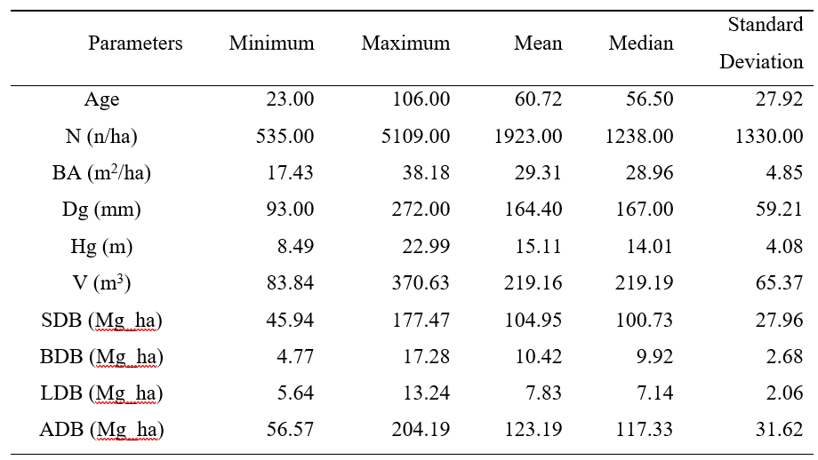
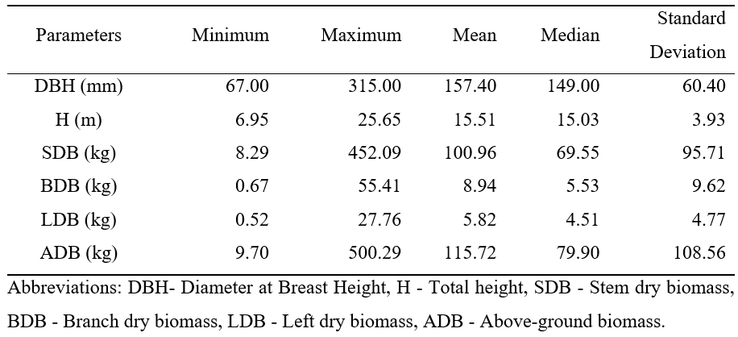

> 🛈 Information: This project was hosted at [GitHub](https://github.com/VietDucNg/treeBiomass-from-AEs-BCEFs).

\

# 1. Introduction

Biomass is increasingly being viewed as a future renewable energy source and is being used in biofuel production, among other things. Biomass research is a useful source of information on the total amount of carbon and nutrients in a forest ecosystem, and it is utilized in natural carbon cycle modeling (Socha J, Wężyk P, 2004). Furthermore, many ecologists are focusing their research on carbon cycling in the biosphere in the age of climate change. Forests are one of the most important carbon repositories among terrestrial ecosystems, collecting carbon globally. Thus, their contribution to mitigating the impact of climate change is critical. Adaptation strategies must be integrated into forest management since climate change will cause changes in tree species' physiology and ranges. There is a pressing need for reliable carbon assessment tools to properly plan for enhancing forest carbon sequestration and calculating their ability to counteract climate change (A. Jagodziński et al., 2018).

Carbon reserves in forest ecosystems must be precisely estimated as a foundation for future actions. Most inventories concentrate on biomass estimation since the carbon content of plant tissues is essentially stable. Thus, biomass assessment accuracy is critical for carbon reporting. Different countries employ different methodologies to country-scale carbon assessment, with inventory levels (tree or stand level) and accuracy varying. Carbon assessment can be based on generalized coefficients, according to the Intergovernmental Panel on Climate Change (IPCC) guidelines. Therefore, carbon reservoirs in forest stands may be underestimated or overestimated. For that reason, IPCC recommends the usage of locally-fitted models of biomass estimation wherever it is possible (A. Jagodziński et al., 2018).

Various tree biomass estimation methods, both direct and indirect, are applied on forest lands. There are two main indirect approaches for biomass estimation: the use of allometric equations (AEs) or biomass conversion and expansion factors (BCEFs). Because AEs are applied at the tree level, while BCEFs are done at the tree-stand level, these two methods differ in accuracy and labor procedures. AEs are tree-level computations that are based on relationships between tree biomass and commonly used measurements, such as diameter at breast height (DBH) or total height (H) (A. M. Jagodziński et al., 2018)c. AEs have the disadvantage of requiring a large amount of labor and accompanying costs, despite their relatively high accuracy. Besides, the empirical equation is considered site-specific and thus may not accurately reflect tree biomass under other site conditions. BCEFs, on the other hand, are literally proportions of forest stand biomass and tree stand volume, allow calculations at the tree-stand level. Expansion factor (BEF) allows converting merchantable timber volume to aboveground, belowground, or total biomass, while merchantable timber volume convergence into stem biomass could be based on conversion factors (BCF). Furthermore, because forest inventories usually lack tree-level data, BCEFs are widely used for large-scale calculations (Neumann et al., 2016). However, this approach may cause double bias by errors from statistical models and errors from forest inventory. In general, two different approaches are used to convert easily measurable tree or stand attributes to total stand biomass.

When modeling biomass equation for total above/belowground biomass of trees and their components, it is worth considering the logical assumption that the sum of the biomass components of the tree estimated using equations should be equal to the estimated biomass of the whole tree (so-called additivity of the biomass models) (Bronisz et al., 2021). This assumption can be met by applying seemingly unrelated regression (SUR). The total biomass regression model is defined as the sum of the individually formulated best regression models of the biomass of its components, with cross-modal correlation used to represent the combined behavior of the separate components. Hence, SUR is increasingly being used in the development of various additive biomass models.

This study aimed to develop a comprehensive set of allometric equations as well as biomass conversion and expansion factors for Scots Pine above-ground biomass at tree and stand levels. The empirical equations and BCEFs will be developed for determining the dry mass of the aboveground part of Scots pine trees and its components (stem, branches, and leaves), using the SUR model with DBH and H as predictors for empirical equations and age, volume, the quadratic mean diameter at the breast height, mean height and basal area as predictors for BCEFs. We hypothesized that (1) Seemingly Unrelated regressions of biomass prediction offer a wide range of capability for application, (2) forest stand features: height, volume, age, diameter, and basal area will influence forest stand biomass and BCEFs.

\

# 2. Material and Method

## 2.1. Study site and species

Scots pine (Pinus sylvestris L.) is a pioneering coniferous tree species that covers more than 28 million hectares in Europe and accounts for more than 20% of total timber productivity. Scots pine may thrive in a variety of environments, from dry, poor arenosols to wet, rich alluvial soils, although it can only breed naturally on poor to medium fertile podzols and brunic arenosols (Ellenberg, 1988). In Poland, Scots pine occupies 5.4 million ha (58.1 percent of forest area) and has a merchantable volume of 1519 million m3 (60.8 percent of total wood resources) according to the National Forest Inventory from 2011 to 2015 (Forest Data Bank, 14-Jun-21). Therefore, Scots pine stands are important carbon reservoirs, contributing significantly to global carbon storage through the biomass of needles, branches, stems, and roots. Due to drought-mediated limitation in southern Europe and cold-mediated limitation in the north, Scots pine reaches the highest dimensions and biomass in Central Europe (Oleksyn et al., 1999).

The research area was established 18 plots in Scots pine stands ranging around 20 - 100 years old (Appendix II). The site types including dry coniferous forest, fresh coniferous forest, fresh mixed coniferous forest according to Polish site classification (Appendix I), which are facilitated condition for Scot pine growth.

```{r message=FALSE, warning=FALSE}
#### overview of the study forest stand ####
# load library for the project
library(systemfit)
library(ggplot2)
library(pastecs)
library(gridExtra)
library(readxl)
library(lmtest)
library(dplyr)
library(tidyr)
library(grid)
library(minpack.lm)
#library(ggpmisc)

# import data
data_tree <- read.csv("data/Scots_pine_2_trees.csv", sep=";")
data_plot <- read.csv("data/Scots_pine_2_plots.csv", sep=";")

# take a look at the data
data_tree
data_plot

# rename tree-level data column
data_tree$D<-data_tree$DBH
data_tree$D2<-data_tree$D^2
data_tree$H<-data_tree$H_m
data_tree$H2<-data_tree$H^2
data_tree$D2H<-data_tree$D2*data_tree$H
data_tree$SDB<-data_tree$SDB_kg
data_tree$BDB<-data_tree$BDB_kg
data_tree$LDB<-data_tree$LDB_kg

# subset data
tree<-with(data_tree, data.frame(Plot,Tree,Site,Age_class,H,D,D2,H2,D2H,SDB,BDB,LDB))
attach(tree)

# data description
stat.desc(data_plot)
summary(data_plot)
stat.desc(data_tree)
summary(data_tree)

```

\

**Table 1.** Overview of the study forest stand



## 2.2. Material

Tree heights and diameters were measured. Besides, the fresh weights of the biomass components were selected and collected, then they were oven-dried to constant mass and were weighed again. Using proportions of dry and fresh masses of samples and total fresh masses of biomass components obtained on the field, we calculated the total dry mass of each biomass component including stem dry biomass (SDB), branches dry biomass (BDB), leaves dry biomass (LDB), and aboveground biomass (ADB).

```{r fig.height=9, fig.width=9}
# data visualization
p1 <- ggplot(data = tree, aes(D)) +
  geom_histogram()+theme_classic()+labs(title = "(a)", x="DBH (mm)")
p2 <- ggplot(data = tree, aes(H)) +
  geom_histogram()+theme_classic()+labs(title = "(b)", x="H (m)")
p3 <-ggplot(data = tree, aes(D,H)) +
  geom_point()+theme_classic()+labs(title = "(c)", x="DBH (mm)", y="H (m)")
p4 <-ggplot(data = tree, aes(D,SDB)) +
  geom_point()+theme_classic()+labs(title = "(D)", x="DBH (mm)", y="SDB (kg)")
p5 <-ggplot(data = tree, aes(D,BDB)) +
  geom_point()+theme_classic()+labs(title = "(e)", x="DBH (mm)", y="BDB (kg)")
p6 <-ggplot(data = tree, aes(D,LDB)) +
  geom_point()+theme_classic()+labs(title = "(f)", x="DBH (mm)", y="LDB (kg)")
p7 <-ggplot(data = tree, aes(H,SDB)) +
  geom_point()+theme_classic()+labs(title = "(g)", x="H (m)", y="SDB (kg)")
p8 <-ggplot(data = tree, aes(H,BDB)) +
  geom_point()+theme_classic()+labs(title = "(h)", x="H (m)", y="BDB (kg)")
p9 <-ggplot(data = tree, aes(H,LDB)) +
  geom_point()+theme_classic()+labs(title = "(i)", x="H (m)", y="LDB (kg)")

tree_description <- grid.arrange(p1,p2,p3,p4,p5,p6,p7,p8,p9, ncol=3,
                                 top= textGrob("Figure 1. Distribution of DBH (a), H (b), and their relationship with tree components (c-i)\n", gp=gpar(fontsize=16)))
```

\

**Table 2.** Overview of tree characteristics 

## 2.3. Method

### 2.3.1. Empirical equaitons

Biomass components were estimated based on equations in previous studies, some of which consider exclusively on DBH or H while others based on both parameters.

$$
(1)\quad W = a + b×DBH \\
(2)\quad W = a + b×DBH^2 \\
(3)\quad W = a + b×H \\
(4)\quad W = a + b×DBH + c×H \\
(5)\quad W = a +b×DBH^2 + c×H^2 \\
(6)\quad W = a + b×DBH^2×H \\
(7)\quad W = a + b×DBH^2 + c×H + d×DBH^2×H \\
(8)\quad W = a×DBH^b \\
(9)\quad W = a×DBH^b×H^c \\
(10)\quad W = a×(DBH^2×H)^b \\
$$

Where: W- dry mass of the considered biomass component (kg), DBH - diameter at breast height (mm), H - height (m), a,b,c - model parameters.

All models were fit to data separately for the stem, branches, and foliage biomass and compared based on the following goodness-of-fit measures: coefficient of determination (R2), residual standard error (RSE), and The Akaike information criterion (AIC).

```{r}
#### regression models for stem dry tree
Ms1 <- nls(SDB~b0+b1*D,start=list(b0=1,b1=1),data=tree)
Ms2 <- nls(SDB~b0+b1*D2,start=list(b0=1,b1=1),data=tree)
Ms3 <- nls(SDB~b0+b1*H,start=list(b0=1,b1=1),data=tree)
Ms4 <- nls(SDB~b0+b1*D+b2*H,start=list(b0=1,b1=1,b2=1),data=tree)
Ms5 <- nls(SDB~b0+b1*D2+b2*H2,start=list(b0=1,b1=1,b2=1),data=tree)
Ms6 <- nls(SDB~b0+b1*D2H,start=list(b0=1,b1=1),data=tree)
Ms7 <- nls(SDB~b0+b1*D2+b2*H+b3*D2H,start=list(b0=1,b1=1,b2=1,b3=1),data=tree)
Ms8 <- nls(SDB~b0*D^b1,start=list(b0=1,b1=1),control=list(maxiter=100),data=tree)
Ms9 <- nls(SDB~b0*D^b1*H^b2,start=list(b0=1,b1=2,b2=1),data=tree,algorithm="port",control=list(maxiter=100))
Ms10 <- nls(SDB~b0*D2H^b1,start=list(b0=1,b1=1),data=tree)

## calculate goodness-of-fit measurements
# R2
Ms1r2 <- 1-(sum({summary(Ms1)$residuals}^2)/sum({SDB-mean(SDB)}^2))
Ms2r2 <- 1-(sum({summary(Ms2)$residuals}^2)/sum({SDB-mean(SDB)}^2))
Ms3r2 <- 1-(sum({summary(Ms3)$residuals}^2)/sum({SDB-mean(SDB)}^2))
Ms4r2 <- 1-(sum({summary(Ms4)$residuals}^2)/sum({SDB-mean(SDB)}^2))
Ms5r2 <- 1-(sum({summary(Ms5)$residuals}^2)/sum({SDB-mean(SDB)}^2))
Ms6r2 <- 1-(sum({summary(Ms6)$residuals}^2)/sum({SDB-mean(SDB)}^2))
Ms7r2 <- 1-(sum({summary(Ms7)$residuals}^2)/sum({SDB-mean(SDB)}^2))
Ms8r2 <- 1-(sum({summary(Ms8)$residuals}^2)/sum({SDB-mean(SDB)}^2))
Ms9r2 <- 1-(sum({summary(Ms9)$residuals}^2)/sum({SDB-mean(SDB)}^2))
Ms10r2 <- 1-(sum({summary(Ms10)$residuals}^2)/sum({SDB-mean(SDB)}^2))

# RSE
Mssrrse <- c(summary(Ms1)$sigma,summary(Ms2)$sigma,summary(Ms3)$sigma,summary(Ms4)$sigma,summary(Ms5)$sigma,summary(Ms6)$sigma,summary(Ms7)$sigma,summary(Ms8)$sigma,summary(Ms9)$sigma,summary(Ms10)$sigma)

# AIC
Mssraic <- AIC(Ms1,Ms2,Ms3,Ms4,Ms5,Ms6,Ms7,Ms8,Ms9,Ms10)$AIC
# R2
Mssrr2 <- c(Ms1r2,Ms2r2,Ms3r2,Ms4r2,Ms5r2,Ms6r2,Ms7r2,Ms8r2,Ms9r2,Ms10r2)

# show goodness-of-fit measurements
Mssrrse
Mssraic
Mssrr2

#### regression models for branches dry tree - BDB [kg] 
Mb1 <- nls(BDB~b0+b1*D,start=list(b0=1,b1=1),data=tree)
Mb2 <- nls(BDB~b0+b1*D2,start=list(b0=1,b1=1),data=tree)
Mb3 <- nls(BDB~b0+b1*H,start=list(b0=1,b1=1),data=tree)
Mb4 <- nls(BDB~b0+b1*D+b2*H,start=list(b0=1,b1=1,b2=1),data=tree)
Mb5 <- nls(BDB~b0+b1*D2+b2*H2,start=list(b0=1,b1=1,b2=1),data=tree)
Mb6 <- nls(BDB~b0+b1*D2H,start=list(b0=1,b1=1),data=tree)
Mb7 <- nls(BDB~b0+b1*D2+b2*H+b3*D2H,start=list(b0=1,b1=1,b2=1,b3=1),data=tree)
#Mb8 <- nls(BDB~b0*D^b1,start=list(b0=1,b1=1),control=list(maxiter=100),data=tree)
Mb9 <- nls(BDB~b0*D^b1*H^b2,start=list(b0=1,b1=2,b2=1),data=tree,algorithm="port",control=list(maxiter=100))
Mb10 <- nls(BDB~b0*D2H^b1,start=list(b0=1,b1=0),data=tree,control=list(maxiter=100))

## calculate goodness-of-fit measurements
# R2
Mb1r2 <- 1-(sum({summary(Mb1)$residuals}^2)/sum({BDB-mean(BDB)}^2))
Mb2r2 <- 1-(sum({summary(Mb2)$residuals}^2)/sum({BDB-mean(BDB)}^2))
Mb3r2 <- 1-(sum({summary(Mb3)$residuals}^2)/sum({BDB-mean(BDB)}^2))
Mb4r2 <- 1-(sum({summary(Mb4)$residuals}^2)/sum({BDB-mean(BDB)}^2))
Mb5r2 <- 1-(sum({summary(Mb5)$residuals}^2)/sum({BDB-mean(BDB)}^2))
Mb6r2 <- 1-(sum({summary(Mb6)$residuals}^2)/sum({BDB-mean(BDB)}^2))
Mb7r2 <- 1-(sum({summary(Mb7)$residuals}^2)/sum({BDB-mean(BDB)}^2))
#Mb8r2 <- 1-(sum({summary(Mb8)$residuals}^2)/sum({BDB-mean(BDB)}^2))
Mb9r2 <- 1-(sum({summary(Mb9)$residuals}^2)/sum({BDB-mean(BDB)}^2))
Mb10r2 <- 1-(sum({summary(Mb10)$residuals}^2)/sum({BDB-mean(BDB)}^2))

# RSE
Mbsrrse <- c(summary(Mb1)$sigma,summary(Mb2)$sigma,summary(Mb3)$sigma,summary(Mb4)$sigma,summary(Mb5)$sigma,summary(Mb6)$sigma,summary(Mb7)$sigma,summary(Mb9)$sigma,summary(Mb10)$sigma)

# AIC
Mbsraic <- AIC(Mb1,Mb2,Mb3,Mb4,Mb5,Mb6,Mb7,Mb9,Mb10)$AIC

#R2
Mbsrr2 <- c(Mb1r2,Mb2r2,Mb3r2,Mb4r2,Mb5r2,Mb6r2,Mb7r2,Mb9r2,Mb10r2)

# show goodness-of-fit measurements
Mbsrrse
Mbsraic
Mbsrr2

#### regression models for leaves dry tree - LDB [kg]
Ml1 <- nls(LDB~b0+b1*D,start=list(b0=1,b1=1),data=tree)
Ml2 <- nls(LDB~b0+b1*D2,start=list(b0=1,b1=1),data=tree)
Ml3 <- nls(LDB~b0+b1*H,start=list(b0=1,b1=1),data=tree)
Ml4 <- nls(LDB~b0+b1*D+b2*H,start=list(b0=1,b1=1,b2=1),data=tree)
Ml5 <- nls(LDB~b0+b1*D2+b2*H2,start=list(b0=1,b1=1,b2=1),data=tree)
Ml6 <- nls(LDB~b0+b1*D2H,start=list(b0=1,b1=1),data=tree)
Ml7 <- nls(LDB~b0+b1*D2+b2*H+b3*D2H,start=list(b0=1,b1=1,b2=1,b3=1),data=tree)
Ml8 <- nls(LDB~b0*D^b1,start=list(b0=1,b1=0),data=tree)
Ml9 <- nls(LDB~b0*D^b1*H^b2,start=list(b0=1,b1=2,b2=1),data=tree)
Ml10 <- nls(LDB~b0*D2H^b1,start=list(b0=1,b1=0),data=tree)

## calculate goodness-of-fit measurements
# R2
Ml1r2 <- 1-(sum({summary(Ml1)$residuals}^2)/sum({LDB-mean(LDB)}^2))
Ml2r2 <- 1-(sum({summary(Ml2)$residuals}^2)/sum({LDB-mean(LDB)}^2))
Ml3r2 <- 1-(sum({summary(Ml3)$residuals}^2)/sum({LDB-mean(LDB)}^2))
Ml4r2 <- 1-(sum({summary(Ml4)$residuals}^2)/sum({LDB-mean(LDB)}^2))
Ml5r2 <- 1-(sum({summary(Ml5)$residuals}^2)/sum({LDB-mean(LDB)}^2))
Ml6r2 <- 1-(sum({summary(Ml6)$residuals}^2)/sum({LDB-mean(LDB)}^2))
Ml7r2 <- 1-(sum({summary(Ml7)$residuals}^2)/sum({LDB-mean(LDB)}^2))
Ml8r2 <- 1-(sum({summary(Ml8)$residuals}^2)/sum({LDB-mean(LDB)}^2))
Ml9r2 <- 1-(sum({summary(Ml9)$residuals}^2)/sum({LDB-mean(LDB)}^2))
Ml10r2 <- 1-(sum({summary(Ml10)$residuals}^2)/sum({LDB-mean(LDB)}^2))

# RSE
Mlsrrse <- c(summary(Ml1)$sigma,summary(Ml2)$sigma,summary(Ml3)$sigma,summary(Ml4)$sigma,summary(Ml5)$sigma,summary(Ml6)$sigma,summary(Ml7)$sigma,summary(Ml8)$sigma,summary(Ml9)$sigma,summary(Ml10)$sigma)

# AIC
Mlsraic <- AIC(Ml1,Ml2,Ml3,Ml4,Ml5,Ml6,Ml7,Ml8,Ml9,Ml10)$AIC

# R2
Mlsrr2 <- c(Ml1r2,Ml2r2,Ml3r2,Ml4r2,Ml5r2,Ml6r2,Ml7r2,Ml8r2,Ml9r2,Ml10r2)

# show goodness-of-fit measurements
Mlsrrse
Mlsraic
Mlsrr2
```

After assessing the goodness-of-fit of each model, the best models for each biomass component were chosen as a base for Seemingly Unrelated Regression. This approach allows fulfillment of the logical assumption that the sum of the estimated biomass components (stem, branches, and foliage) should be equal to the estimated total aboveground biomass, assuring additivity of the biomass equations (Bronisz et al., 2016). We created a set of allometric equations that took into account all of the sample trees. Although the study design may have an impact on the model, we chose a simpler approach (non-linear models) instead of mixed-effects models to maximize model applicability.

```{r}
#### Seemingly Unrelated Regression - SUR
Ms.formula<- SDB~b0*D^b1*H^b2
Mb.formula<- BDB~b3*D^b4*H^b5
Ml.formula<- LDB~b6+b7*D2+b8*H2

equations <- list(Ms.formula,Mb.formula,Ml.formula)
start.values <- c(b0=0.0005357  ,b1=1.6941255  ,b2=1.2137352  
                  ,b3=5.215e-06,b4=3.609e+00,b5=-1.532e+00,
                  b6=1.224e+00, b7=2.484e-04,b8 = -9.576e-03)
labels <- list("SDB","BDB","LDB")

SUR<-nlsystemfit(method ="SUR",equations,start.values,data=tree,eqnlabels=labels)

print(SUR)
summary(SUR)
SUR$eq[3]
SUR$resids
SUR$nlmest
```

### 2.3.2. Biomass conversion and expansion factors

```{r fig.height=8, fig.width=9}
#### visualization of Relationship between tree volume and ADB, SDB, BDB, LDB
# subset data for forest stand level
plot <- with(data_plot, data.frame(Plot,Site, Tree.species, Age,BA_m2_ha,
                                   N_trees_ha,Dg_mm,Hg_m,V_m3_ha,SDB_Mg_ha,
                                   BDB_Mg_ha,LDB_Mg_ha,ADB_Mg_ha))
# rename forest stand data column
plot$age <- plot$Age
plot$BA <- plot$BA_m2_ha
plot$Dg <- plot$Dg_mm
plot$Hg <- plot$Hg_m
plot$V <- plot$V_m3_ha
plot$ADB <- plot$ADB_Mg_ha
plot$SDB <- plot$SDB_Mg_ha
plot$BDB <- plot$BDB_Mg_ha
plot$LDB <- plot$LDB_Mg_ha

# data discription
p12 <- ggplot(data = plot, aes(V,ADB))+
  geom_point()+ labs(title = "(a)", x ="V (m3)" , y="ADB (Mg_ha)")+
  geom_smooth(method = "lm",se = FALSE, color = "black")+
  theme_bw()
p13 <- ggplot(data = plot, aes(V,SDB))+
  geom_point()+ labs(title = "(b)", x ="V (m3)" , y="SDB (Mg_ha)")+
  geom_smooth(method = "lm",se = FALSE, color = "black")+
  theme_bw()
p14 <- ggplot(data = plot, aes(V,BDB))+
  geom_point()+ labs(title = "(c)", x ="V (m3)" , y="BDB (Mg_ha)")+
  geom_smooth(method = "lm",se = FALSE, color = "black")+
  theme_bw()
p15 <- ggplot(data = plot, aes(V,LDB))+
  geom_point()+ labs(title = "(d)", x ="V (m3)" , y="LDB (Mg_ha)")+
  geom_smooth(method = "lm",se = FALSE, color = "black")+
  theme_bw()

grid.arrange(p12,p13,p14,p15,ncol=2, top=textGrob('Figure 2. Relationship between tree volume (V) and \n ADB (a), SDB (b), BDB (c), and LDB (d).\n', gp=gpar(fontsize=16)))
```

For stand-level biomass analyses, we calculated BCEFs based on the dry biomass per hectare of particular components (stem, branches, foliage, and aboveground biomass) and stem volume per hectare as BCEF = W/V, where W - dry mass of the considered biomass component [Mg ha−1] and V - total stem volume of trees [m3 ha−1]. The following model types were used to analyze the correlations between BCEFs and tree stand characteristics:

$$
(11)\quad BCEF = a×x^b  \\
(12)\quad BCEF = a+b×log(x) \\
(13)\quad BCEF = a+b/x  \\
(14)\quad BCEF = e^{-( a+b/x)}  \\
(15)\quad BCEF = a + b×e^{-(c/x)}   \\
$$

where x - considered tree stand characteristic (age, basal area, volume, quadratic mean diameter, mean height), a, b and c - model coefficients, and e - base of the natural logarithm.

```{r}
#### nls models for BEF_SDB
plot$BEF_SDB<-plot$SDB/plot$V
summary(plot$BEF_SDB)

### age
BEF_SDB<-plot$BEF_SDB
x<-plot$age

M1<-nls(BEF_SDB~a*x^b,start=list(a=1,b=1))
M2<-nls(BEF_SDB~a+b*log(x),start=list(a=1,b=1))
M3<-nls(BEF_SDB~a+b/x,start=list(a=1,b=1))
M4<-nls(BEF_SDB~exp(a+b/x),start=list(a=1,b=1))
M5<-nlsLM(BEF_SDB~a+b*exp(-x*c),start=list(a=1,b=1,c=1))

## goodness-of-fit measurement
M1_r2 <- 1-(sum({summary(M1)$residuals}^2)/sum({BEF_SDB-mean(BEF_SDB)}^2))
M2_r2 <- 1-(sum({summary(M2)$residuals}^2)/sum({BEF_SDB-mean(BEF_SDB)}^2))
M3_r2 <- 1-(sum({summary(M3)$residuals}^2)/sum({BEF_SDB-mean(BEF_SDB)}^2))
M4_r2 <- 1-(sum({summary(M4)$residuals}^2)/sum({BEF_SDB-mean(BEF_SDB)}^2))
M5_r2 <- 1-(sum({summary(M5)$residuals}^2)/sum({BEF_SDB-mean(BEF_SDB)}^2))

## show goodness-of-fit measurement
# R2
R2<-c(M1_r2,M2_r2,M3_r2,M4_r2,M5_r2)
R2

# RSE
rse<- c(summary(M1)$sigma,summary(M2)$sigma,summary(M3)$sigma,
        summary(M4)$sigma,summary(M5)$sigma)
rse

### BA
BEF_SDB<-plot$BEF_SDB
x<-plot$BA

M1<-nls(BEF_SDB~a*x^b,start=list(a=1,b=1))
M2<-nls(BEF_SDB~a+b*log(x),start=list(a=1,b=1))
M3<-nls(BEF_SDB~a+b/x,start=list(a=1,b=1))
M4<-nls(BEF_SDB~exp(a+b/x),start=list(a=1,b=1))
# M5<-nlsLM(BEF_SDB~a+b*exp(-x*c),start=list(a=1,b=1,c=1))

## goodeness-of-fit measurement
M1_r2 <- 1-(sum({summary(M1)$residuals}^2)/sum({BEF_SDB-mean(BEF_SDB)}^2))
M2_r2 <- 1-(sum({summary(M2)$residuals}^2)/sum({BEF_SDB-mean(BEF_SDB)}^2))
M3_r2 <- 1-(sum({summary(M3)$residuals}^2)/sum({BEF_SDB-mean(BEF_SDB)}^2))
M4_r2 <- 1-(sum({summary(M4)$residuals}^2)/sum({BEF_SDB-mean(BEF_SDB)}^2))
M5_r2 <- 1-(sum({summary(M5)$residuals}^2)/sum({BEF_SDB-mean(BEF_SDB)}^2))

## show goodness-of-fit measurement
# R2
R2<-c(M1_r2,M2_r2,M3_r2,M4_r2,M5_r2)
R2

# RSE
rse<- c(summary(M1)$sigma,summary(M2)$sigma,summary(M3)$sigma,
        summary(M4)$sigma,summary(M5)$sigma)
rse

### Dg
BEF_SDB<-plot$BEF_SDB
x<-plot$Dg

M1<-nls(BEF_SDB~a*x^b,start=list(a=1,b=1))
M2<-nls(BEF_SDB~a+b*log(x),start=list(a=1,b=1))
M3<-nls(BEF_SDB~a+b/x,start=list(a=1,b=1))
M4<-nls(BEF_SDB~exp(a+b/x),start=list(a=1,b=1))
# M5<-nlsLM(BEF_SDB~a+b*exp(-x*c),start=list(a=1,b=1,c=1))

## goodness-of-fit measurement
M1_r2 <- 1-(sum({summary(M1)$residuals}^2)/sum({BEF_SDB-mean(BEF_SDB)}^2))
M2_r2 <- 1-(sum({summary(M2)$residuals}^2)/sum({BEF_SDB-mean(BEF_SDB)}^2))
M3_r2 <- 1-(sum({summary(M3)$residuals}^2)/sum({BEF_SDB-mean(BEF_SDB)}^2))
M4_r2 <- 1-(sum({summary(M4)$residuals}^2)/sum({BEF_SDB-mean(BEF_SDB)}^2))
# M5_r2 <- 1-(sum({summary(M5)$residuals}^2)/sum({BEF_SDB-mean(BEF_SDB)}^2))

## show goodness-of-fit measurement
# R2
R2<-c(M1_r2,M2_r2,M3_r2,M4_r2,M5_r2)
R2

# RSE
rse<- c(summary(M1)$sigma,summary(M2)$sigma,summary(M3)$sigma,
        summary(M4)$sigma,summary(M5)$sigma)
rse

### Hg
BEF_SDB<-plot$BEF_SDB
x<-plot$Hg

M1<-nls(BEF_SDB~a*x^b,start=list(a=1,b=1))
M2<-nls(BEF_SDB~a+b*log(x),start=list(a=1,b=1))
M3<-nls(BEF_SDB~a+b/x,start=list(a=1,b=1))
M4<-nls(BEF_SDB~exp(a+b/x),start=list(a=1,b=1))
# M5<-nlsLM(BEF_SDB~a+b*exp(-x*c),start=list(a=1,b=1,c=1))

## goodness-of-fit measurement
M1_r2 <- 1-(sum({summary(M1)$residuals}^2)/sum({BEF_SDB-mean(BEF_SDB)}^2))
M2_r2 <- 1-(sum({summary(M2)$residuals}^2)/sum({BEF_SDB-mean(BEF_SDB)}^2))
M3_r2 <- 1-(sum({summary(M3)$residuals}^2)/sum({BEF_SDB-mean(BEF_SDB)}^2))
M4_r2 <- 1-(sum({summary(M4)$residuals}^2)/sum({BEF_SDB-mean(BEF_SDB)}^2))
# M5_r2 <- 1-(sum({summary(M5)$residuals}^2)/sum({BEF_SDB-mean(BEF_SDB)}^2))

## show goodness-of-fit measurement
# R2
R2<-c(M1_r2,M2_r2,M3_r2,M4_r2,M5_r2)
R2

# RSE
rse<- c(summary(M1)$sigma,summary(M2)$sigma,summary(M3)$sigma,
        summary(M4)$sigma,summary(M5)$sigma)
rse

### V
BEF_SDB<-plot$BEF_SDB
x<-plot$V

M1<-nls(BEF_SDB~a*x^b,start=list(a=1,b=1))
M2<-nls(BEF_SDB~a+b*log(x),start=list(a=1,b=1))
M3<-nls(BEF_SDB~a+b/x,start=list(a=1,b=1))
M4<-nls(BEF_SDB~exp(a+b/x),start=list(a=1,b=1))
#M5<-nlsLM(BEF_SDB~a+b*exp(-x*c),start=list(a=1,b=1,c=1))

## goodness-of-fit measurement
M1_r2 <- 1-(sum({summary(M1)$residuals}^2)/sum({BEF_SDB-mean(BEF_SDB)}^2))
M2_r2 <- 1-(sum({summary(M2)$residuals}^2)/sum({BEF_SDB-mean(BEF_SDB)}^2))
M3_r2 <- 1-(sum({summary(M3)$residuals}^2)/sum({BEF_SDB-mean(BEF_SDB)}^2))
M4_r2 <- 1-(sum({summary(M4)$residuals}^2)/sum({BEF_SDB-mean(BEF_SDB)}^2))
#M5_r2 <- 1-(sum({summary(M5)$residuals}^2)/sum({BEF_SDB-mean(BEF_SDB)}^2))

## show goodness-of-fit measurement
#R2
R2<-c(M1_r2,M2_r2,M3_r2,M4_r2,M5_r2)
R2

# RSE
rse<- c(summary(M1)$sigma,summary(M2)$sigma,summary(M3)$sigma,
        summary(M4)$sigma,summary(M5)$sigma)
rse

#### nls models for BEF_BDB ####
### age
plot$BEF_BDB <- plot$BDB/plot$V
BEF_BDB<-plot$BEF_BDB
x<-plot$age

M1<-nls(BEF_BDB~a*x^b,start=list(a=1,b=1))
M2<-nls(BEF_BDB~a+b*log(x),start=list(a=1,b=1))
M3<-nls(BEF_BDB~a+b/x,start=list(a=1,b=1))
M4<-nls(BEF_BDB~exp(a+b/x),start=list(a=1,b=1))
M5<-nlsLM(BEF_BDB~a+b*exp(-x*c),start=list(a=1,b=1,c=1))

## goodness-of-fit measurement
M1_r2 <- 1-(sum({summary(M1)$residuals}^2)/sum({BEF_BDB-mean(BEF_BDB)}^2))
M2_r2 <- 1-(sum({summary(M2)$residuals}^2)/sum({BEF_BDB-mean(BEF_BDB)}^2))
M3_r2 <- 1-(sum({summary(M3)$residuals}^2)/sum({BEF_BDB-mean(BEF_BDB)}^2))
M4_r2 <- 1-(sum({summary(M4)$residuals}^2)/sum({BEF_BDB-mean(BEF_BDB)}^2))
M5_r2 <- 1-(sum({summary(M5)$residuals}^2)/sum({BEF_BDB-mean(BEF_BDB)}^2))

## show goodness-of-fit measurement
# R2
R2<-c(M1_r2,M2_r2,M3_r2,M4_r2,M5_r2)
R2

# RSE
rse<- c(summary(M1)$sigma,summary(M2)$sigma,summary(M3)$sigma,
        summary(M4)$sigma,summary(M5)$sigma)
rse

### BA
BEF_BDB<-plot$BEF_BDB
x<-plot$BA

M1<-nls(BEF_BDB~a*x^b,start=list(a=1,b=1))
M2<-nls(BEF_BDB~a+b*log(x),start=list(a=1,b=1))
M3<-nls(BEF_BDB~a+b/x,start=list(a=1,b=1))
M4<-nls(BEF_BDB~exp(a+b/x),start=list(a=1,b=1))
#M5<-nlsLM(BEF_LDB~a+b*exp(-x*c),start=list(a=0.03,b=0.7,c=0.5))

## goodness-of-fit measurement
M1_r2 <- 1-(sum({summary(M1)$residuals}^2)/sum({BEF_BDB-mean(BEF_BDB)}^2))
M2_r2 <- 1-(sum({summary(M2)$residuals}^2)/sum({BEF_BDB-mean(BEF_BDB)}^2))
M3_r2 <- 1-(sum({summary(M3)$residuals}^2)/sum({BEF_BDB-mean(BEF_BDB)}^2))
M4_r2 <- 1-(sum({summary(M4)$residuals}^2)/sum({BEF_BDB-mean(BEF_BDB)}^2))
#M5_r2 <- 1-(sum({summary(M5)$residuals}^2)/sum({BEF_BDB-mean(BEF_BDB)}^2))

## show goodness-of-fit measurement
# R2
R2<-c(M1_r2,M2_r2,M3_r2,M4_r2,M5_r2)
R2

# RSE
rse<- c(summary(M1)$sigma,summary(M2)$sigma,summary(M3)$sigma,
        summary(M4)$sigma,summary(M5)$sigma)
rse

### Dg
BEF_BDB<-plot$BEF_BDB
x<-plot$Dg

M1<-nls(BEF_BDB~a*x^b,start=list(a=1,b=1))
M2<-nls(BEF_BDB~a+b*log(x),start=list(a=1,b=1))
M3<-nls(BEF_BDB~a+b/x,start=list(a=1,b=1))
M4<-nls(BEF_BDB~exp(a+b/x),start=list(a=1,b=1))
# M5<-nlsLM(BEF_BDB~a+b*exp(-x*c),start=list(a=1,b=1,c=1))

## goodness-of-fit measurement
M1_r2 <- 1-(sum({summary(M1)$residuals}^2)/sum({BEF_BDB-mean(BEF_BDB)}^2))
M2_r2 <- 1-(sum({summary(M2)$residuals}^2)/sum({BEF_BDB-mean(BEF_BDB)}^2))
M3_r2 <- 1-(sum({summary(M3)$residuals}^2)/sum({BEF_BDB-mean(BEF_BDB)}^2))
M4_r2 <- 1-(sum({summary(M4)$residuals}^2)/sum({BEF_BDB-mean(BEF_BDB)}^2))
# M5_r2 <- 1-(sum({summary(M5)$residuals}^2)/sum({BEF_BDB-mean(BEF_BDB)}^2))

## show goodness-of-fit measurement
# R2
R2<-c(M1_r2,M2_r2,M3_r2,M4_r2,M5_r2)
R2

# RSE
rse<- c(summary(M1)$sigma,summary(M2)$sigma,summary(M3)$sigma,
        summary(M4)$sigma,summary(M5)$sigma)
rse

### Hg
BEF_BDB<-plot$BEF_BDB
x<-plot$Hg

M1<-nls(BEF_BDB~a*x^b,start=list(a=1,b=1))
M2<-nls(BEF_BDB~a+b*log(x),start=list(a=1,b=1))
M3<-nls(BEF_BDB~a+b/x,start=list(a=1,b=1))
M4<-nls(BEF_BDB~exp(a+b/x),start=list(a=1,b=1))
#M5<-nlsLM(BEF_BDB~a+b*exp(-x*c),start=list(a=1,b=1,c=1))

## goodness-of-fit measurement
M1_r2 <- 1-(sum({summary(M1)$residuals}^2)/sum({BEF_BDB-mean(BEF_BDB)}^2))
M2_r2 <- 1-(sum({summary(M2)$residuals}^2)/sum({BEF_BDB-mean(BEF_BDB)}^2))
M3_r2 <- 1-(sum({summary(M3)$residuals}^2)/sum({BEF_BDB-mean(BEF_BDB)}^2))
M4_r2 <- 1-(sum({summary(M4)$residuals}^2)/sum({BEF_BDB-mean(BEF_BDB)}^2))
#M5_r2 <- 1-(sum({summary(M5)$residuals}^2)/sum({BEF_BDB-mean(BEF_BDB)}^2))

## show goodness-of-fit measurement
# R2
R2<-c(M1_r2,M2_r2,M3_r2,M4_r2,M5_r2)
R2

# RSE
rse<- c(summary(M1)$sigma,summary(M2)$sigma,summary(M3)$sigma,
        summary(M4)$sigma,summary(M5)$sigma)
rse

### V
BEF_BDB<-plot$BEF_BDB
x<-plot$V

M1<-nls(BEF_BDB~a*x^b,start=list(a=1,b=1))
M2<-nls(BEF_BDB~a+b*log(x),start=list(a=1,b=1))
M3<-nls(BEF_BDB~a+b/x,start=list(a=1,b=1))
M4<-nls(BEF_BDB~exp(a+b/x),start=list(a=1,b=1))
#M5<-nlsLM(BEF_BDB~a+b*exp(-x*c),start=list(a=1,b=1,c=1))

## goodness-of-fit measurement
M1_r2 <- 1-(sum({summary(M1)$residuals}^2)/sum({BEF_BDB-mean(BEF_BDB)}^2))
M2_r2 <- 1-(sum({summary(M2)$residuals}^2)/sum({BEF_BDB-mean(BEF_BDB)}^2))
M3_r2 <- 1-(sum({summary(M3)$residuals}^2)/sum({BEF_BDB-mean(BEF_BDB)}^2))
M4_r2 <- 1-(sum({summary(M4)$residuals}^2)/sum({BEF_BDB-mean(BEF_BDB)}^2))
#M5_r2 <- 1-(sum({summary(M5)$residuals}^2)/sum({BEF_BDB-mean(BEF_BDB)}^2))

## show goodness-of-fit measurement
# R2
R2<-c(M1_r2,M2_r2,M3_r2,M4_r2,M5_r2)
R2

# RSE
rse<- c(summary(M1)$sigma,summary(M2)$sigma,summary(M3)$sigma,
        summary(M4)$sigma,summary(M5)$sigma)
rse

#### nls models for BEF_LDB
### age
plot$BEF_LDB<-plot$LDB/plot$V
BEF_LDB<-plot$BEF_LDB
x<-plot$age

M1<-nls(BEF_LDB~a*x^b,start=list(a=1,b=1))
M2<-nls(BEF_LDB~a+b*log(x),start=list(a=1,b=1))
M3<-nls(BEF_LDB~a+b/x,start=list(a=1,b=1))
M4<-nls(BEF_LDB~exp(a+b/x),start=list(a=1,b=1))
M5<-nlsLM(BEF_LDB~a+b*exp(-x*c),start=list(a=1,b=1,c=1))

## goodness-of-fit measurement
M1_r2 <- 1-(sum({summary(M1)$residuals}^2)/sum({BEF_LDB-mean(BEF_LDB)}^2))
M2_r2 <- 1-(sum({summary(M2)$residuals}^2)/sum({BEF_LDB-mean(BEF_LDB)}^2))
M3_r2 <- 1-(sum({summary(M3)$residuals}^2)/sum({BEF_LDB-mean(BEF_LDB)}^2))
M4_r2 <- 1-(sum({summary(M4)$residuals}^2)/sum({BEF_LDB-mean(BEF_LDB)}^2))
M5_r2 <- 1-(sum({summary(M5)$residuals}^2)/sum({BEF_LDB-mean(BEF_LDB)}^2))

## show goodness-of-fit measuremnt
# R2
R2<-c(M1_r2,M2_r2,M3_r2,M4_r2,M5_r2)
R2

# RSE
rse<- c(summary(M1)$sigma,summary(M2)$sigma,summary(M3)$sigma,
        summary(M4)$sigma,summary(M5)$sigma)
rse

### BA
BEF_LDB<-plot$BEF_LDB
x<-plot$BA

M1<-nls(BEF_LDB~a*x^b,start=list(a=1,b=1))
M2<-nls(BEF_LDB~a+b*log(x),start=list(a=1,b=1))
M3<-nls(BEF_LDB~a+b/x,start=list(a=1,b=1))
M4<-nls(BEF_LDB~exp(a+b/x),start=list(a=1,b=1))
# M5<-nlsLM(BEF_LDB~a+b*exp(-x*c),start=list(a=1,b=1,c=1))

## goodness-of-fit measurement
M1_r2 <- 1-(sum({summary(M1)$residuals}^2)/sum({BEF_LDB-mean(BEF_LDB)}^2))
M2_r2 <- 1-(sum({summary(M2)$residuals}^2)/sum({BEF_LDB-mean(BEF_LDB)}^2))
M3_r2 <- 1-(sum({summary(M3)$residuals}^2)/sum({BEF_LDB-mean(BEF_LDB)}^2))
M4_r2 <- 1-(sum({summary(M4)$residuals}^2)/sum({BEF_LDB-mean(BEF_LDB)}^2))
#M5_r2 <- 1-(sum({summary(M5)$residuals}^2)/sum({BEF_LDB-mean(BEF_LDB)}^2))

## show goodness-of-fit measurement
# R2
R2<-c(M1_r2,M2_r2,M3_r2,M4_r2,M5_r2)
R2

# RSE
rse<- c(summary(M1)$sigma,summary(M2)$sigma,summary(M3)$sigma,
        summary(M4)$sigma,summary(M5)$sigma)
rse

### Dg
BEF_LDB<-plot$BEF_LDB
x<-plot$Dg

M1<-nls(BEF_LDB~a*x^b,start=list(a=1,b=1))
M2<-nls(BEF_LDB~a+b*log(x),start=list(a=1,b=1))
M3<-nls(BEF_LDB~a+b/x,start=list(a=1,b=1))
M4<-nls(BEF_LDB~exp(a+b/x),start=list(a=1,b=1))
#M5<-nls(BEF_LDB~a+b*exp(-x*c),start=list(a=1,b=1,c=1))

## goodness-of-fit measurement
M1_r2 <- 1-(sum({summary(M1)$residuals}^2)/sum({BEF_LDB-mean(BEF_LDB)}^2))
M2_r2 <- 1-(sum({summary(M2)$residuals}^2)/sum({BEF_LDB-mean(BEF_LDB)}^2))
M3_r2 <- 1-(sum({summary(M3)$residuals}^2)/sum({BEF_LDB-mean(BEF_LDB)}^2))
M4_r2 <- 1-(sum({summary(M4)$residuals}^2)/sum({BEF_LDB-mean(BEF_LDB)}^2))
# M5_r2 <- 1-(sum({summary(M5)$residuals}^2)/sum({BEF_LDB-mean(BEF_LDB)}^2))

## show goodness-of-fit measurement
# R2
R2<-c(M1_r2,M2_r2,M3_r2,M4_r2,M5_r2)
R2

# RSE
rse<- c(summary(M1)$sigma,summary(M2)$sigma,summary(M3)$sigma,
        summary(M4)$sigma,summary(M5)$sigma)
rse

### Hg
BEF_LDB<-plot$BEF_LDB
x<-plot$Hg

M1<-nls(BEF_LDB~a*x^b,start=list(a=1,b=1))
M2<-nls(BEF_LDB~a+b*log(x),start=list(a=1,b=1))
M3<-nls(BEF_LDB~a+b/x,start=list(a=1,b=1))
M4<-nls(BEF_LDB~exp(a+b/x),start=list(a=1,b=1))
#M5<-nlsLM(BEF_LDB~a+b*exp(-x*c),start=list(a=1,b=1,c=1))

## goodness-of-fit measurement
M1_r2 <- 1-(sum({summary(M1)$residuals}^2)/sum({BEF_LDB-mean(BEF_LDB)}^2))
M2_r2 <- 1-(sum({summary(M2)$residuals}^2)/sum({BEF_LDB-mean(BEF_LDB)}^2))
M3_r2 <- 1-(sum({summary(M3)$residuals}^2)/sum({BEF_LDB-mean(BEF_LDB)}^2))
M4_r2 <- 1-(sum({summary(M4)$residuals}^2)/sum({BEF_LDB-mean(BEF_LDB)}^2))
# M5_r2 <- 1-(sum({summary(M5)$residuals}^2)/sum({BEF_LDB-mean(BEF_LDB)}^2))

## show goodness-of-fit measurement
# R2
R2<-c(M1_r2,M2_r2,M3_r2,M4_r2,M5_r2)
R2

# RSE
rse<- c(summary(M1)$sigma,summary(M2)$sigma,summary(M3)$sigma,
        summary(M4)$sigma,summary(M5)$sigma)
rse


### V
BEF_LDB<-plot$BEF_LDB
x<-plot$V

M1<-nls(BEF_LDB~a*x^b,start=list(a=1,b=1))
M2<-nls(BEF_LDB~a+b*log(x),start=list(a=1,b=1))
M3<-nls(BEF_LDB~a+b/x,start=list(a=1,b=1))
M4<-nls(BEF_LDB~exp(a+b/x),start=list(a=1,b=1))
#M5<-nlsLM(BEF_LDB~a+b*exp(-x*c),start=list(a=1,b=1,c=1))

## goodness-of-fit measurement
M1_r2 <- 1-(sum({summary(M1)$residuals}^2)/sum({BEF_LDB-mean(BEF_LDB)}^2))
M2_r2 <- 1-(sum({summary(M2)$residuals}^2)/sum({BEF_LDB-mean(BEF_LDB)}^2))
M3_r2 <- 1-(sum({summary(M3)$residuals}^2)/sum({BEF_LDB-mean(BEF_LDB)}^2))
M4_r2 <- 1-(sum({summary(M4)$residuals}^2)/sum({BEF_LDB-mean(BEF_LDB)}^2))
#M5_r2 <- 1-(sum({summary(M5)$residuals}^2)/sum({BEF_LDB-mean(BEF_LDB)}^2))

## show goodness-of-fit measurement
# R2
R2<-c(M1_r2,M2_r2,M3_r2,M4_r2,M5_r2)
R2

# RSE
rse<- c(summary(M1)$sigma,summary(M2)$sigma,summary(M3)$sigma,
        summary(M4)$sigma,summary(M5)$sigma)
rse

```

The best models were chosen based on the goodness of fit of the resulting models and their parameters were assessed by examining the pattern of residuals, coefficient of determination (R2), and residual standard error (RSE). Lastly, all chosen models of every biomass component were used as a base for Seemingly Unrelated Regression (SUR). This approach allows fulfillment of the logical assumption that the sum of the estimated biomass components (stem, branches, and foliage) should be equal to the estimated total aboveground biomass, assuring additivity of the biomass equations (Bronisz et al., 2016).

```{r}
#### Seemingly Unrelated Regression - SUR for BEF
Ms.formula<- BEF_SDB~b0*Hg^b1
Mb.formula<- BEF_BDB~b2*Hg^b3
Ml.formula<- BEF_LDB~exp(b4+b5/Dg)

equations <- list(Ms.formula,Mb.formula,Ml.formula)
start.values <- c(b0=0.99532  ,b1=-0.26835  ,b2=0.119390
                  ,b3=-0.338020,b4=-4.351000,b5=150.518260)
labels <- list("BEF_SDB","BEF_BDB","BEF_LDB")

SUR<-nlsystemfit(method ="SUR",equations,start.values,data=plot,eqnlabels=labels)

print(SUR)
summary(SUR)
SUR$eq[3]
SUR$resids
SUR$nlmest

```

\

# 3. Results and Discussion

## 3.1. Allometric equations

All the allometric equations developed for each biomass component explained from 69.5 to 98.4% of the variation in biomass. For SDB, BDB and LDB, R2 varied from 0.801 to 0.984, from 0.695 to 0.795, and from 0.741 to 0.789, respectively

```{r}
# R2 for SDB estimation
Mssrr2
# R2 for BDB estimation
Mbsrr2
# R2 for LDB estimation
Mlsrr2
```

### 3.1.1. Model fitting

Based on the goodness-of-fit measures and model parameters' accuracy, the most appropriate equations to estimate stem, branches, and foliage biomass were chosen separately (Table 3). Models number 9 and 5 showed the high goodness-of-fit in most cases. Notably, in terms of coefficient of determination, SDB was predicted much more accurately compared to BDB and LDB, with the R2 value is 0.984, 0.795, 0.789, respectively. In contrast, predicted models for BDB and LDB show better RSE and AIC values than the SDB. In general, biomass components were predicted by both DBH and H present better accuracy than models with exclusively DBH or H as independent variables.

```{r}
# best model (9) for SDB estimation
summary(Ms9)
# best model (9) for BDB estimation
summary(Mb9)
# best model (5) for LDB estimation
summary(Ml5)
```

**Table 3.** Goodness-of-fit measures of the best models for SDB, BDB, and LDB.

| Biomass Component | Col2   | Col3    | Col4    |
|-------------------|--------|---------|---------|
| Equation No.      | 9      | 9       | 5       |
| a                 | 0.001  | 0.00001 | 1.224   |
| SE (a)            | 0.0001 | 0.00001 | 0.6071  |
| b                 | 1.694  | 3.609   | 0.00025 |
| SE (b)            | 0.091  | 0.395   | 0.00003 |
| c                 | 1.214  | -1.532  | -0.010  |
| SE (c)            | 0.130  | 0.493   | 0.005   |
| R2                | 0.984  | 0.795   | 0.789   |
| RSE               | 12.174 | 4.403   | 2.219   |
| AIC               | 710.2  | 527.2   | 403.9   |

### 3.1.2. Seemingly Unrelated Regression

Models for different small biomass parts were fitted. Because total aboveground biomass is explicitly related to the biomass of tree components as their sum, it was not included in the set of equations. Estimates for all biomass components were obtained as a function of DBH and height (Table 4). Residual distribution for analyzed aboveground biomass models and the relationship between predicted and observed ADB are shown in Figure 3.

**Table 4.** Goodness-of-fit for the final models for biomass components. Parameters (a, b, c) with their standard errors (SE) and R2 = coefficient of determination, RSE = residual standard error.

| Biomass Component | Equation No. | a        | SE (a)  | b     | SE (b) | c      | SE (c) | R2    | RMSE  |
|--------|--------|--------|--------|--------|--------|--------|--------|--------|--------|
| SDB               | 9            | 0.0005   | 0.0001  | 1.620 | 0.084  | 1.344  | 0.118  | 0.984 | 12.25 |
| BDB               | 9            | 0.000006 | 0.00005 | 3.337 | 0.330  | -1.063 | 0.400  | 0.793 | 4.43  |
| LDB               | 5            | 0.440    | 0.435   | 0.000 | 0.000  | -0.004 | 0.004  | 0.784 | 2.24  |

```{r}
#### visualization of model residuals and model fitting
# load prediction result
ADB_predicted <- read_excel("data/ADB_predicted.xlsx")

# residuals plot
p10 <- ggplot(data = ADB_predicted, aes(ADB_predicted$pridicted, ADB_predicted$residuals))+
  geom_point()+theme_bw()+labs(title = "(a)", x="Predicted ADB (kg)", y="Residuals")

## ADB measured and predicted plot
# load prediction and reference data 
ADB_compare <- read_excel("data/ADB_compare.xlsx")


p11 <- ggplot(data = ADB_compare, aes(ADB_compare$Measured,ADB_compare$predicted))+
  geom_point()+labs(title = "(b)",x="Observed ADB (kg)", y="Predicted ADB (kg)")+
  geom_smooth(method='lm',se = FALSE, color="black")+
  # stat_poly_eq(formula = y ~ x, 
  #              aes(label = paste(..eq.label.., ..rr.label.., sep = "~~~")), 
  #              parse = TRUE)+
  theme_bw()

grid.arrange(p10,p11,ncol=2, top='Figure 3. Distribution of residuals for analyzed aboveground biomass models (a) \n and the relationship between predicted and observed aboveground biomass (ADB).\n')

```

## 3.2. Biomass conversion and expansion factor

### 3.2.1. Model fitting

At the tree stand level, Scots pine biomass components were strongly correlated with mean H and DBH (Figure. 4, Table. 5). The correlation with age, basal area, and volume were weaker. BCEFs of young Scots pine tree stands differed across components and tree stand characteristics.

```{r fig.height=12, fig.width=9}
#### visualization of relationships between biomass component ~ stand characteristics
### SDB ~ stand characteristics

p16 <- ggplot(data = plot, aes(BEF_SDB,age))+
  geom_point()+ labs(title = "SDB",x="",y="")+
  geom_smooth(method = "lm",se = FALSE, color = "black")+
  theme_bw()+
  theme(plot.title = element_text(hjust = 0.5))+
  theme(axis.title.x=element_blank(),
        axis.text.x=element_blank(),
        axis.ticks.x=element_blank())

p17 <- ggplot(data = plot, aes(BEF_SDB,BA))+
  geom_point()+ labs(x="",y="")+
  geom_smooth(method = "lm",se = FALSE, color = "black")+
  theme_bw()+
  theme(axis.title.x=element_blank(),
        axis.text.x=element_blank(),
        axis.ticks.x=element_blank())

p18 <- ggplot(data = plot, aes(BEF_SDB,Dg))+
  geom_point()+ labs(x="",y="")+
  geom_smooth(method = "lm",se = FALSE, color = "black")+
  theme_bw()+
  theme(axis.title.x=element_blank(),
        axis.text.x=element_blank(),
        axis.ticks.x=element_blank())

p19 <- ggplot(data = plot, aes(BEF_SDB, Hg))+
  geom_point()+ labs(x="",y="")+
  geom_smooth(method = "lm",se = FALSE, color = "black")+
  theme_bw()+
  theme(axis.title.x=element_blank(),
        axis.text.x=element_blank(),
        axis.ticks.x=element_blank())

p20 <- ggplot(data = plot, aes(BEF_SDB, V))+
  geom_point()+ labs(x="",y="")+
  geom_smooth(method = "lm",se = FALSE, color = "black")+
  theme_bw()
  
### BDB ~ stand characteristics
p21 <- ggplot(data = plot, aes(BEF_BDB,age))+
  geom_point()+ labs(title = "BDB",x="",y="")+
  geom_smooth(method = "lm",se = FALSE, color = "black")+
  theme_bw()+
  theme(plot.title = element_text(hjust = 0.5))+
  theme(axis.text.x=element_blank(),
        axis.ticks.x=element_blank(),
        axis.text.y=element_blank(),
        axis.ticks.y=element_blank(),)

p22 <- ggplot(data = plot, aes(BEF_BDB,BA))+
  geom_point()+ labs(x="",y="")+
  geom_smooth(method = "lm",se = FALSE, color = "black")+
  theme_bw()+
  theme(axis.title.x=element_blank(),
        axis.text.x=element_blank(),
        axis.ticks.x=element_blank(),
        axis.text.y=element_blank(),
        axis.ticks.y=element_blank(),)

p23 <- ggplot(data = plot, aes(BEF_BDB,Dg))+
  geom_point()+ labs(x="",y="")+
  geom_smooth(method = "lm",se = FALSE, color = "black")+
  theme_bw()+
  theme(axis.text.x=element_blank(),
        axis.ticks.x=element_blank(),
        axis.text.y=element_blank(),
        axis.ticks.y=element_blank())

p24 <- ggplot(data = plot, aes(BEF_BDB, Hg))+
  geom_point()+ labs(x="",y="")+
  geom_smooth(method = "lm",se = FALSE, color = "black")+
  theme_bw()+
  theme(axis.title.x=element_blank(),
        axis.text.x=element_blank(),
        axis.ticks.x=element_blank(),
        axis.text.y=element_blank(),
        axis.ticks.y=element_blank())

p25 <- ggplot(data = plot, aes(BEF_BDB, V))+
  geom_point()+ labs(x="",y="")+
  geom_smooth(method = "lm",se = FALSE, color = "black")+
  theme_bw()+
  theme(axis.text.y=element_blank(),
        axis.ticks.y=element_blank())

### LDB ~ stand characteristics
p26 <- ggplot(data = plot, aes(BEF_LDB,age))+
  geom_point()+ labs(title = "LDB",x="",y="Age")+
  geom_smooth(method = "lm",se = FALSE, color = "black")+
  theme_bw()+
  theme(plot.title = element_text(hjust = 0.5))+
  theme(axis.text.x=element_blank(),
        axis.ticks.x=element_blank(),
        axis.text.y=element_blank(),
        axis.ticks.y=element_blank())+
  scale_y_continuous(position = "right")

p27 <- ggplot(data = plot, aes(BEF_LDB,BA))+
  geom_point()+ labs(x="",y="BA")+
  geom_smooth(method = "lm",se = FALSE, color = "black")+
  theme_bw()+
  theme(axis.title.x=element_blank(),
        axis.text.x=element_blank(),
        axis.ticks.x=element_blank(),
        axis.text.y=element_blank(),
        axis.ticks.y=element_blank())+
  scale_y_continuous(position = "right")

p28 <- ggplot(data = plot, aes(BEF_LDB,Dg))+
  geom_point()+ labs(x="",y="Dg")+
  geom_smooth(method = "lm",se = FALSE, color = "black")+
  theme_bw()+
  theme(axis.text.x=element_blank(),
        axis.ticks.x=element_blank(),
        axis.text.y=element_blank(),
        axis.ticks.y=element_blank())+
  scale_y_continuous(position = "right")

p29 <- ggplot(data = plot, aes(BEF_LDB, Hg))+
  geom_point()+ labs(x="",y="Hg")+
  geom_smooth(method = "lm",se = FALSE, color = "black")+
  theme_bw()+
  theme(axis.title.x=element_blank(),
        axis.text.x=element_blank(),
        axis.ticks.x=element_blank(),
        axis.text.y=element_blank(),
        axis.ticks.y=element_blank())+
  scale_y_continuous(position = "right")

p30 <- ggplot(data = plot, aes(BEF_LDB, V))+
  geom_point()+ labs(x="",y="V")+
  geom_smooth(method = "lm",se = FALSE, color = "black")+
  theme_bw()+
  theme(axis.text.y=element_blank(),
        axis.ticks.y=element_blank())+
  scale_y_continuous(position = "right")

grid.arrange(p16,p21,p26,p17,p22,p27,p18,p23,p28,p19,p24,p29,p20,p25,p30,
             ncol=3, left = textGrob("BEF",rot = 90, gp=gpar(fontsize=16)),
             top=textGrob('Figure 4. Relationships between tree stand characteristics and BCEFs \n for biomass components:  branches (BDB), foliage (LDB), and stem (SDB). \n',gp=gpar(fontsize=16)))
```

Based on the goodness-of-fit measures and model parameters' accuracy, the most appropriate equations to estimate BCEFs of stem, branches, and foliage were chosen separately (Table 5). Models number 4 and 1 showed the high goodness-of-fit in most cases. Notably, in terms of coefficient of determination, BCEFs of LDB were predicted much more accurately compared to BDB and SDB, with the R2 value is 0.973 and 0.789, 0.711, respectively.

**Table 5.** Goodness-of-fit of the best models for estimating BCEFs of SDB, BDB, and LDB.

| BEF | Predictor | Equation No. | a      | SE (a) | b      | SE (b) | R2    | RSE   |
|-----|-----------|--------------|--------|--------|--------|--------|-------|-------|
| SDB | Hg        | 1            | 0.995  | 0.113  | -0.268 | 0.043  | 0.711 | 0.024 |
| BDB | Hg        | 1            | 0.119  | 0.014  | -0.338 | 0.043  | 0.789 | 0.002 |
| LDB | Dg        | 4            | -4.351 | 0.057  | -150.5 | 6.552  | 0.973 | 0.002 |

### 3.2.2. Seemingly Unrelated Regression

Models for BCEFs of different small biomass parts were fitted. The best-fitted models of different biomass parts were used as a base for Seemingly Unrelated Regression (SUR) (Table 6). This approach enabled fulfillment of the logical assumption that the sum of the estimated biomass values of tree parts matches the estimated total biomass, assuring additivity of the biomass equations.

**Table 6.** Goodness-of-fit of the final models for biomass components. Parameters (a, b, c) with their standard errors (SE) and R2 = coefficient of determination, RSE = residual standard error.

| BEF | Predictor | Equation No. | a      | SE (a) | b        | SE (b) | R2    | RSE    |
|-----|-----------|--------------|--------|--------|----------|--------|-------|--------|
| SDB | Hg        | 1            | 1.037  | 0.116  | -0.284   | 0.042  | 0.709 | 0.0237 |
| BDB | Hg        | 1            | 0.125  | 0.014  | -0.355   | 0.043  | 0.787 | 0.0024 |
| LDB | Dg        | 4            | -4.378 | 0.057  | -153.859 | 6.447  | 0.972 | 0.0024 |

Residual distributions for analyzed BCEFs of biomass components are shown in Figure 5. The relationship between predicted and observed ADB (kg) using calculated BCEFs is shown in Figure 6. Figure 5 and Figure 6 show that predicted ADB calculated by BCEFs is relatively accurate, with the coefficient of determination is equal to 0.976 explaining almost entirely variation of measured ADB.

```{r fig.height=7, fig.width=9}
# load data
BEF_predicted <- read_excel("data/BEF_predicted.xlsx")

# residuals plot
p31 <- ggplot(data = BEF_predicted, aes(BEF_predicted$SDB_pre, BEF_predicted$SDB_re))+
  geom_point()+theme_bw()+labs(title = "SDB", x="Predicted BEF", y="Residuals")+
  theme(plot.title = element_text(hjust = 0.5))
p32 <- ggplot(data = BEF_predicted, aes(BEF_predicted$BDB_pre, BEF_predicted$BDB_re))+
  geom_point()+theme_bw()+labs(title = "BDB", x="Predicted BEF", y="Residuals")+
  theme(plot.title = element_text(hjust = 0.5))
p33 <- ggplot(data = BEF_predicted, aes(BEF_predicted$LDB_pre, BEF_predicted$LDB_re))+
  geom_point()+theme_bw()+labs(title = "LDB", x="Predicted BEF", y="Residuals")+
  theme(plot.title = element_text(hjust = 0.5))
p34 <- ggplot(data = BEF_predicted, aes(BEF_predicted$ADB_pre, BEF_predicted$ADB_re))+
  geom_point()+theme_bw()+labs(title = "ADB", x="Predicted BEF", y="Residuals")+
  theme(plot.title = element_text(hjust = 0.5))

grid.arrange(p31,p32,p33,p34,ncol=2, top=textGrob('Figure 5. Distribution of residuals for analyzed BCEFs of biomass components.\n', gp=gpar(fontsize=16)))
```

```{r}
# ADB measured and predicted plot
BEF_ADB_compare <- read_excel("data/BEF_ADB_compare.xlsx")

ggplot(data = BEF_ADB_compare, aes(ADB,ADB_predicted))+
  geom_point()+labs(x="Observed ADB (kg)", y="Predicted ADB (kg)")+
  geom_smooth(method='lm',se = FALSE, color="black")+
  theme_bw()+
  labs(title = 'Figure 6. Relationship between predicted and observed ADB (kg) \n using calculated BCEFs.\n')
  # stat_poly_eq(formula = y ~ x, 
  #              aes(label = paste(..eq.label.., ..rr.label.., sep = "~~~")), 
  #              parse = TRUE)+
```

\

# 4. Conclusion

-   Our study provided a comprehensive overview of the tree- and stand-level assessments of aboveground biomass estimation for Scots pine in the study area.

-   Elaborated empirical equations are built to estimate the value of the biomass of the tree's above-ground component for Scots pine. Biomass models based on DBH and H are better than models based exclusively on DBH or H. The equations presented at this stage should only be used locally for the tree stands of the research area due to the provenance of the material for the investigations. The produced results can have considerable systematic errors if they are used outside of the study area, although the SUR approach has a relatively wide variety of applications. The accuracy of the produced formula must be assessed on an independent empirical material derived from various habitats and regions of the pine range before they can be used on a larger scale.

-   Stand-level equations based on BCEFs are provided based on the relationships between tree characteristics and biomass components. The calculated BCEFs may be a useful tool for assessing the biomass and carbon sequestration of the Scots pine stands. However, due to BCEFs are site-specific factors, they should only be applied in similar conditions. In this study, we suggest Dg and Hg might be the best predictors for the stands.

\

# References

Bronisz, K., Bijak, S., Wojtan, R., Tomusiak, R., Bronisz, A., Baran, P., & Zasada, M. (2021). Seemingly Unrelated Mixed-Effects Biomass Models for Black Locust in West Poland. Forests, 12(3), 380. <https://doi.org/10.3390/f12030380>

Bronisz, K., Strub, M., Cieszewski, C., Bijak, S., Bronisz, A., Tomusiak, R., Wojtan, R., & Zasada, M. (2016). Empirical equations for estimating aboveground biomass of Betula pendula growing on former farmland in central Poland. Silva Fennica, 50(4). <https://doi.org/10.14214/sf.1559>

Ellenberg, H. (1988). Vegetation ecology of Central Europe (4th ed.). Cambridge University Press. Forest Data Bank. (14-Jun-21). <https://www.bdl.lasy.gov.pl/portal/>

Jagodziński, A., Dyderski, M., Gęsikiewicz, K., & Horodecki, P. (2018). Tree- and Stand-Level Biomass Estimation in a Larix decidua Mill. Chronosequence. Forests, 9(10), 587. <https://doi.org/10.3390/f9100587>

Jagodziński, A. M., Dyderski, M. K., Gęsikiewicz, K., Horodecki, P., Cysewska, A., Wierczyńska, S., & Maciejczyk, K. (2018). How do tree stand parameters affect young Scots pine biomass? -- Allometric equations and biomass conversion and expansion factors. Forest Ecology and Management, 409, 74--83. <https://doi.org/10.1016/j.foreco.2017.11.001>

Neumann, M., Moreno, A., Mues, V., Härkönen, S., Mura, M., Bouriaud, O., Lang, M., Achten, W. M., Thivolle-Cazat, A., Bronisz, K., Merganič, J., Decuyper, M., Alberdi, I., Astrup, R., Mohren, F., & Hasenauer, H. (2016). Comparison of carbon estimation methods for European forests. Forest Ecology and Management, 361, 397--420. <https://doi.org/10.1016/j.foreco.2015.11.016>

Oleksyn, J., Reich, P. B., Chalupka, W., & Tjoelker, M. G. (1999). Differential Above- and Below-ground Biomass Accumulation of European Pinus sylvestris Populations in a 12-year-old Provenance Experiment. Scandinavian Journal of Forest Research, 14(1), 7--17. <https://doi.org/10.1080/02827589908540804>

Socha J, Wężyk P. (2004). EMPIRICAL FORMULAE TO ASSESS THE BIOMASS OF THE ABOVE-GROUND PART OF PINE TREES. <http://www.ejpau.media.pl/volume7/issue2/forestry/art-04.html>

\

# Appendix I

**Table 7.** Scots Pine tree level data

```{r}
data_tree
```

\

# Appendix II

**Table 8.** Scots Pine plot level data

```{r}
data_plot
```
